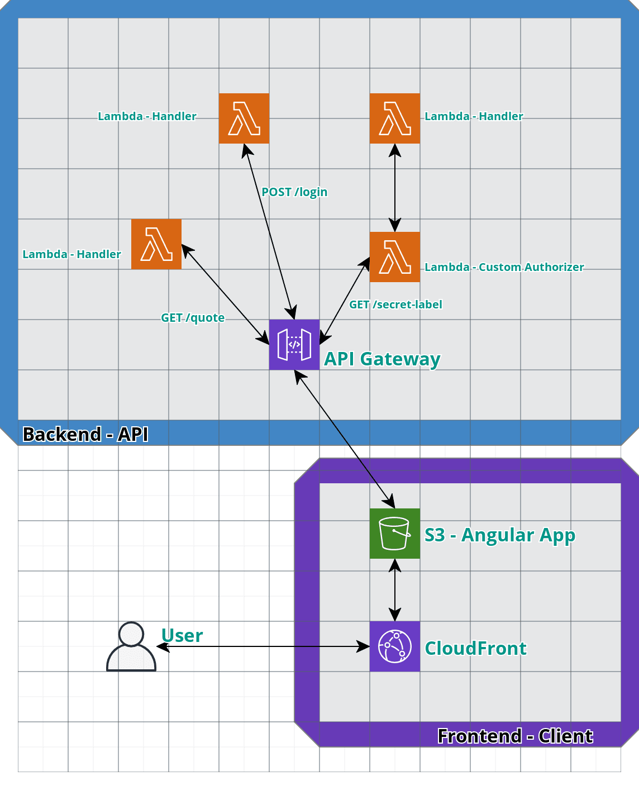

# Secret Quotes
Get random quotes and secret quotes !
This repo practice authentication concept in serverless architecture.

The overview is simple: if user is not logged, he/she can get only simple quotes. If user is logged, he/she can get simple and secret quotes.

# Architecture
AWS was the choosed cloud provider.

You can see an overview of architecture below:

# Built With
**API:**
* [Node](https://nodejs.org/en/)
* [Serverless](https://serverless.com/)

**CLIENT:**
* [Angular](https://nodejs.org/en/)
* [Bootstrap](https://getbootstrap.com/)

# Runnig locally
To run locally, first you need to install api and client dependencies. Each one have a README with instructions to install and to run.
After this, you just need to access the frontend app using a browser (in http://localhost:4200) or doing requests to api (in http://localhost:3000).

# Contributing

Only have to fork the project and make a pull request.

# Versioning and git

For git branchs is used [Git Flow](https://www.atlassian.com/git/tutorials/comparing-workflows/gitflow-workflow).

For git messages is used something like [Karma git commit message](http://karma-runner.github.io/4.0/dev/git-commit-msg.html).

For versioning is used [SemVer](http://semver.org/).

# License
See the [LICENSE](LICENSE.md) file for license rights and limitations (MIT).

# Notes
For improvements and todos, go to [Issues](https://github.com/MagnunAVF/secret-quotes/issues).